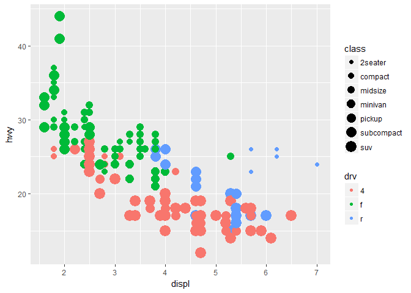

Plot-Making Tutorial
================
Maggie Fu
2018-01-10

Deliverable
-----------

``` r
library(tidyverse)
```

    ## Warning: package 'tidyverse' was built under R version 3.4.3

    ## -- Attaching packages ------------------------------------------------------------------------------ tidyverse 1.2.1 --

    ## v ggplot2 2.2.1     v purrr   0.2.4
    ## v tibble  1.4.1     v dplyr   0.7.4
    ## v tidyr   0.7.2     v stringr 1.2.0
    ## v readr   1.1.1     v forcats 0.2.0

    ## Warning: package 'tibble' was built under R version 3.4.3

    ## Warning: package 'forcats' was built under R version 3.4.3

    ## -- Conflicts --------------------------------------------------------------------------------- tidyverse_conflicts() --
    ## x dplyr::filter() masks stats::filter()
    ## x dplyr::lag()    masks stats::lag()

``` r
ggplot(mpg, aes(displ, hwy, size = class, color = drv)) + geom_point()
```

    ## Warning: Using size for a discrete variable is not advised.


