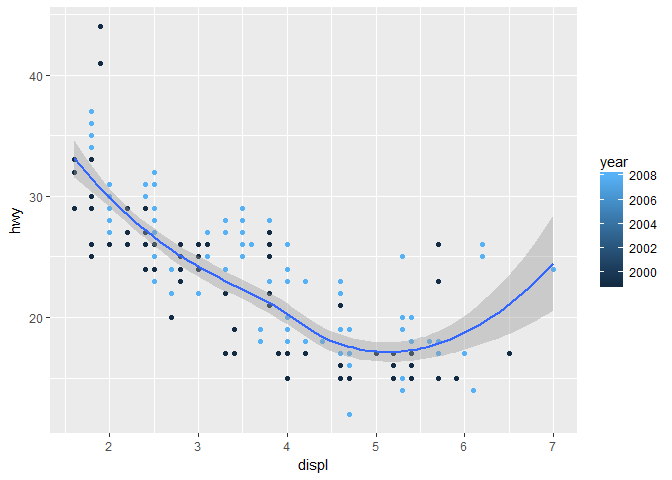
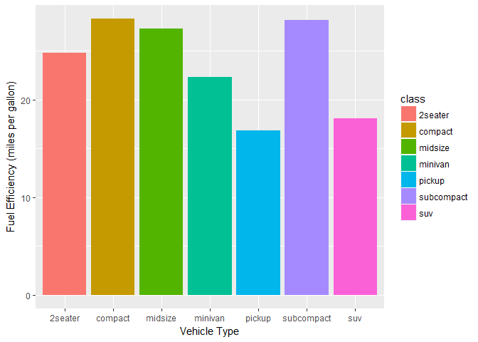
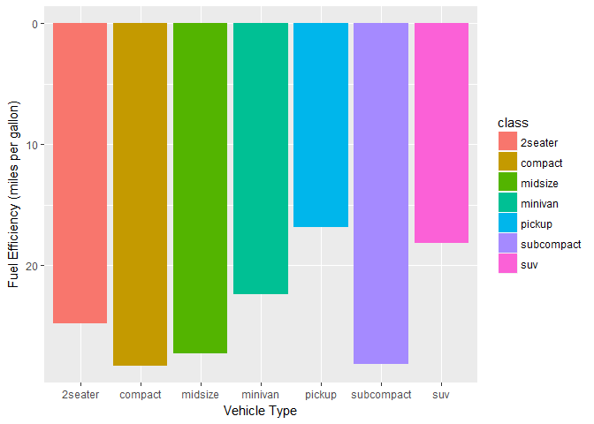
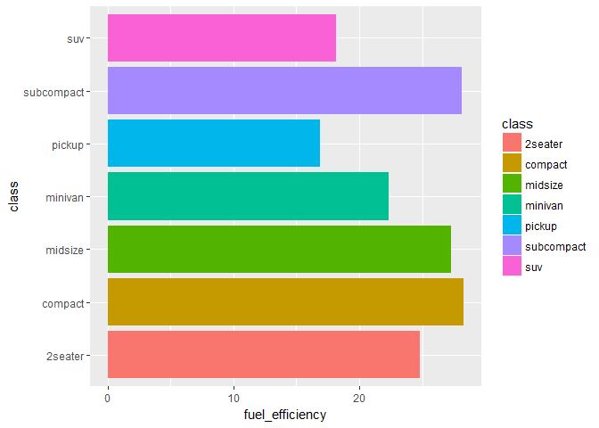
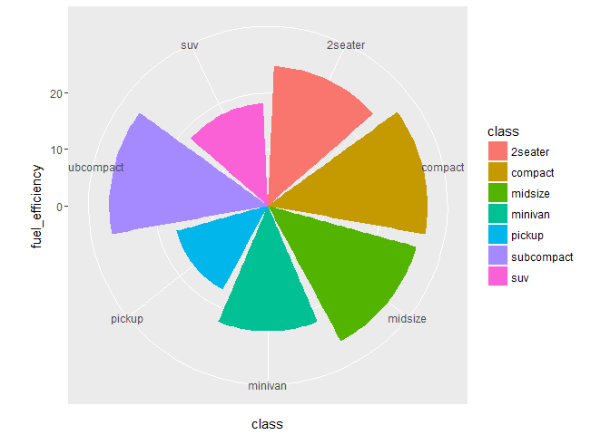
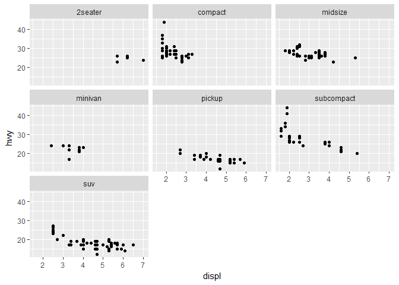

Plot-Making Tutorial
================
Maggie Fu
2018-01-10

Setup
-----

``` r
install.packages("tidyverse", dependencies = TRUE)
```

mpg data frame
--------------

``` r
head(mpg)
?mpg
```

Creating a ggplot
-----------------

``` r
library(tidyverse)
```

    ## Warning: package 'tidyverse' was built under R version 3.4.3

    ## -- Attaching packages ------------------------------------------------------------------------------ tidyverse 1.2.1 --

    ## v ggplot2 2.2.1     v purrr   0.2.4
    ## v tibble  1.4.1     v dplyr   0.7.4
    ## v tidyr   0.7.2     v stringr 1.2.0
    ## v readr   1.1.1     v forcats 0.2.0

    ## Warning: package 'tibble' was built under R version 3.4.3

    ## Warning: package 'forcats' was built under R version 3.4.3

    ## -- Conflicts --------------------------------------------------------------------------------- tidyverse_conflicts() --
    ## x dplyr::filter() masks stats::filter()
    ## x dplyr::lag()    masks stats::lag()

``` r
ggplot(data = mpg) + geom_point(mapping = aes(x = displ, y = hwy, color = class))
```


New Template
------------

New template ggplot(data = <DATA>) + <GEOM_FUNCTION>( mapping = aes(<MAPPINGS>), stat = <STAT>, position = <POSITION> ) + <COORDINATE_FUNCTION> + <SCALE_FUNCTION> + <AXIS_FUNCTION> + <FACET_FUNCTION>

### Smooth line

``` r
ggplot(data = mpg, mapping = aes(x = displ, y = hwy)) + geom_point() +geom_smooth()
```

    ## `geom_smooth()` using method = 'loess'


### Continuous variable as the third dimension

``` r
ggplot(data = mpg, mapping = aes(x = displ, y = hwy, color = year)) + geom_point() + geom_smooth()
```

    ## `geom_smooth()` using method = 'loess'



Bar plots
---------

``` r
averageEfficiency <- mpg %>% group_by(class) %>% summarise(fuel_efficiency = mean(hwy))

# axis label
ggplot(averageEfficiency) + geom_bar(aes(x = class, y = fuel_efficiency, fill = class), stat = "identity") + ylab("Fuel Efficiency (miles per gallon)") + xlab("Vehicle Type")
```



``` r
# scale inversion
ggplot(averageEfficiency) + 
  geom_bar(aes(x = class, y = fuel_efficiency, fill = class),
           stat = "identity") +
  ylab("Fuel Efficiency (miles per gallon)") +
  xlab("Vehicle Type") +
  scale_y_reverse()
```



``` r
# coordination flip
ggplot(averageEfficiency) + 
  geom_bar(aes(x = class, y = fuel_efficiency, fill = class),
           stat = "identity") +
  coord_flip()
```



``` r
# pie chart
ggplot(averageEfficiency) + 
  geom_bar(aes(x = class, y = fuel_efficiency, fill = class),
           stat = "identity") +
  coord_polar()
```



Mutiple plots
-------------

``` r
ggplot(data = mpg, mapping = aes(x = displ, y = hwy)) + geom_point() + facet_wrap(~class)
```



Deliverable
-----------

``` r
ggplot(mpg, aes(displ, hwy, size = class, color = drv)) + geom_point()
```

    ## Warning: Using size for a discrete variable is not advised.


